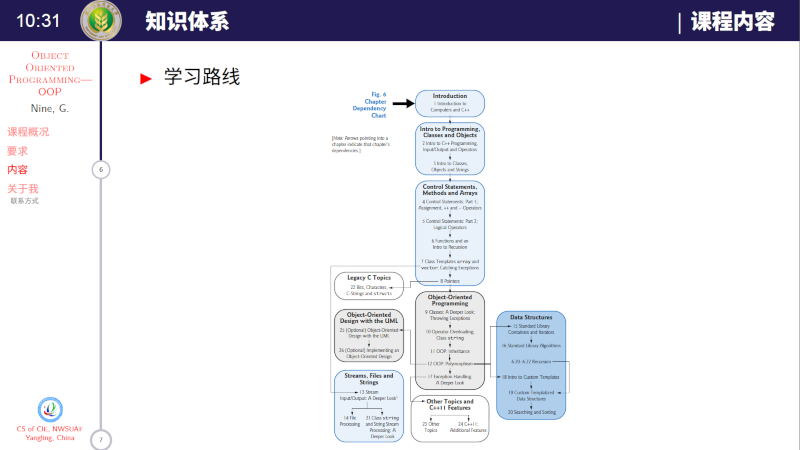
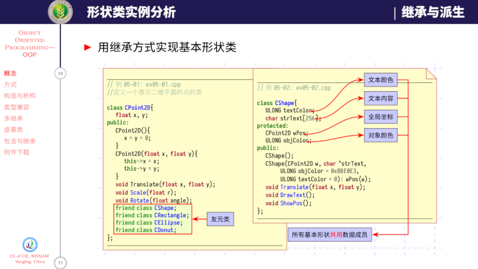
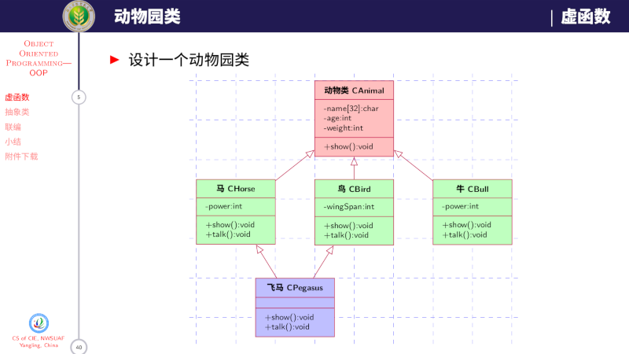

# cpplects-beamer

#### 项目介绍
用LaTeX的Beamer编写的《C++面向对象程序设计》演示文稿课件。

从2014年开始，断断续续写到现在，由于水平有限，感觉越来越吃力，在此向各位讨教，希望能让代码更合理，效果更好。

Happy LaTeX！~

#### 编译说明：

1. 本文档要求仅在Ubuntu + TeXLive2019(更新至2020年2月12日)上进行了测试，未在MacTeX、MikTeX等发行版中进行测试。
2. 由于使用了minted宏包编排涉及到的代码，因此，需要安装Python及其Pygments组件，并要求为编译命令添加“-shell-escape”参数。
3. 请使用XeLaTeX的编译至少3次以实现交叉引用和边栏目录结构，编译命令是：xelatex -shell-escape -interaction=nonstopmode，其中-shell-escape是使用minted宏包需要的参数。
4. 为方便绘制流程图，使用了作者开发的流程图绘制宏包。
5. 为方便绘制UML图，修改了Yuan Xu开发的UML图绘制宏包，并重命名为“pgf-umlcd-gn.sty”。
6. 修改了原tdclock时钟宏包，以解决用XeLaTeX编译时产生的垂直遮挡问题，请使用当前目录下的“tdclock.sty”宏包
7. 为能够分文件编译时指定加载不同的宏包和自定义命令，并设置不同的Beamer子标题，。在编译前，请打开“main.tex”文件，修改第26行的“\chno=0”为需要的章节号。
8. 本文档使用了自定义字体设置，请参考`settings`目录下的“format.tex”的0-60行进行调整，如果不需要自定义自体，请注释或删除这些代码，并将ctexbeamer宏包的“fontset = none”参数删除。在“format.tex”的12-17行提供了字体下载链接，在此不提供字体文件。
9. 配套课件**不支持** [CTeX 套装](http://www.ctex.org/CTeXDownload)编译。

### 排版样例
---------------------

1. 排版样例

2. 更多样例请查看"./demos"。

*注意*：如果带有时钟，则需要使用Adobe的PDF阅读器进行查看。

3. 排版中除了照片和截图外，所有插图全基于TikZ实现。

#### 字体下载

- [iosevka](https://github.com/be5invis/Iosevka/releases)

- [Libertinus](https://github.com/alif-type/libertinus/releases)

- [sarasa-gothic/mono](https://github.com/be5invis/Sarasa-Gothic/releases)

- [SourceHanSerif](https://github.com/adobe-fonts/source-han-serif/releases)

- [SourceHanSans](https://github.com/adobe-fonts/source-han-sans/releases)

#### 反馈问题

如果发现代码问题，请按照以下步骤操作：

1. 将 TeX 发行版和宏包升级到最新，并且将模板升级到 Github 上最新版本，
查看问题是否已经修复；
2. 在 [GitHub Issues](https://github.com/registor/cpplects-beamer/issues)
中搜索该问题的关键词；
3. 在 [GitHub Issues](https://github.com/registor/cpplects-beamer/issues)
中提出新 issue，并回答以下问题：
    - 使用了什么版本的 TeX Live / MacTeX / MikTeX ？
    - 具体的问题是什么？
    - 正确的结果应该是什么样的？
    - 是否应该附上相关源码或者截图？
4. 联系作者：西北农林科技大学信息工程学院耿楠

